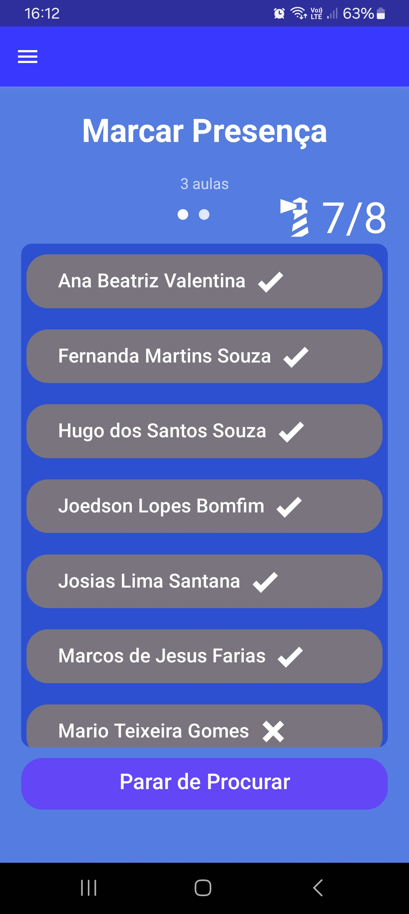

# Aplicação para marcar presença em ambiente escolar

### Composto por dois aplicativos mobile, um destinado ao aluno (nomeado BeaconCheck), que simula beacons (especificamente o iBeacon) e o outro destinado ao professor (nomeado CheckMate), que identifica beacons no ambiente. 

### Foi desenvolvido para o Trabalho de Conclusão de Curso (TCC) do ensino superior de Tecnologia em Análise e Desenvolvimento de Sistemas do Instituto Federal da Bahia - Campus Guanambi. O trabalho foi realizado por <a href="https://github.com/Joedson-Bomfim"><b>Joedson Bomfim</a>, tendo como orientador e idealizador do projeto <a href="https://github.com/fabiomicromais"><b>Fabio Lima</a>.

## Tecnologias

 


Foi desenvolvido especificamente com o React Native CLI

## Telas

- ### Tela Aluno que simula Beacon

<div align="center">
    
</div>

- ### Tela Home Professor

<div align="center">
    
</div>

- ### Tela Professor para marcar presença (Identificação de beacons e dados ilustrativos)

<div align="center">
    
</div>

- ### Exemplo de dados hipotéticos exportados pelo professor (formato XML)

<div align="center">
    
</div>

## Funcionalidades Principais

### Aluno
> Simular de beacon

### Professor

> Identificar de beacons
>
> Marcar presença do aluno
>
> Exportar dos registros de presença
>

## Código para simulação de beacon

- Dependência: [react-native-ibeacon-simulator](https://github.com/rodrigo-nexudus/react-native-ibeacon-simulator)

```javascript
export const startBeaconBroadcasting = (uuidValue, setIsBroadcasting) => {
  BeaconBroadcast.checkTransmissionSupported()
    .then(() => {
      BeaconBroadcast.startAdvertisingBeaconWithString(uuidValue, identifier, major, minor);
      setIsBroadcasting(true);
      console.log('Beacon broadcasting started successfully.');
    })
    .catch((error) => {
      console.error('Beacon broadcasting failed:', error);
    });
};

export const stopBeaconBroadcasting = (setIsBroadcasting) => {
  BeaconBroadcast.stopAdvertisingBeacon();
  setIsBroadcasting(false);
  console.log('Beacon broadcasting stopped.');
};
```

## Código para identificação de beacon

- Dependência: [react-native-beacons-manager](https://github.com/rodrigo-nexudus/react-native-beacons-manager)

Observação: Possui uma lógica para identificar um determinado beacon apenas uma vez, isso é devido ao fluxo proposto na aplicação

```javascript
const startBeaconRanging = async () => {
    Beacons.detectIBeacons();
    setEstadoBeacon(true);

    try {
      await Beacons.startRangingBeaconsInRegion('Sala1');
      console.log('Varredura de beacons iniciada com sucesso!');
    } catch (error) {
      console.log('Varredura de beacons não iniciada, erro:', error);
    }

    // Configura o ouvinte para a varredura de beacons
    const listener = Beacons.BeaconsEventEmitter.addListener('beaconsDidRange', (data) => {
      if (data.beacons.length > 0) {
        // Filtra e armazena apenas UUIDs novos
        setUuidList(prevSet => {
          const newUuids = data.beacons
            .map(beacon => beacon.uuid) // Extrai UUIDs dos beacons
            .filter(uuid => !prevSet.has(uuid)); // Filtra UUIDs novos

          if (newUuids.length > 0) {
            console.log('Novos UUIDs coletados:', newUuids);
            // Cria um novo Set que inclui os UUIDs antigos e novos
            return new Set([...prevSet, ...newUuids]);
          } else {
            console.log('Nenhum novo UUID coletado.');
            return prevSet; // Retorna o Set atual se não houver novos UUIDs
          }
        });
      } else {
        console.log('Nenhum dado de beacon coletado.');
      }
    });

    setBeaconsDidRangeListener(listener);
  };

  const stopBeaconRanging = async () => {
    if (beaconsDidRangeListener) {
      beaconsDidRangeListener.remove();
      console.log('Listener de beacons removido.');
    }
    try {
      await Beacons.stopRangingBeaconsInRegion('Sala1');
      setEstadoBeacon(false);
      console.log('Varredura de beacons parada com sucesso.');
    } catch (error) {
      console.log('Erro ao parar a varredura de beacons:', error);
    }
  };
```

## Colaboradores 
<table align="center">
	    <tr>
	        <td align="center">
	            <a href="https://github.com/Joedson-Bomfim">
	                
	                <br/>
	                <b>Joedson Bomfim</b>
	            </a>
	            <br>Orientando e desenvolvedor</br>
	        </td>
	        <td align="center">
	            <a href="https://github.com/fabiomicromais"> 
			    
	                <br/>
			<b>Fabio Lima</b>
	            </a>
	            <br>Orientador e idealizador do projeto</br>
	        </td>
	    </tr>
</table>
